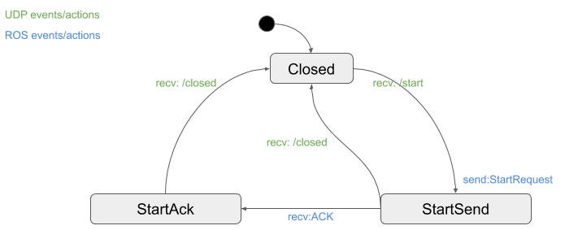

# StateMachineNode
This node demonstrates how a [boost::msm State Machine](https://www.boost.org/doc/libs/1_64_0/libs/msm/doc/HTML/index.html) can be setup to both handle
IO operations (in this case reading UDP) and react to ROS Events (in this case service calls).



## Usage
Start the node with
```
rosrun state_machine_node state_machine_node
```

### 1. Transition to Start
```
rosservice call /start
```

### 2. Send fake acknowledge via UDP
```
rosrun state_machine_node send_ack
```

### 3. Transition to Close
```
rosservice call /close
```